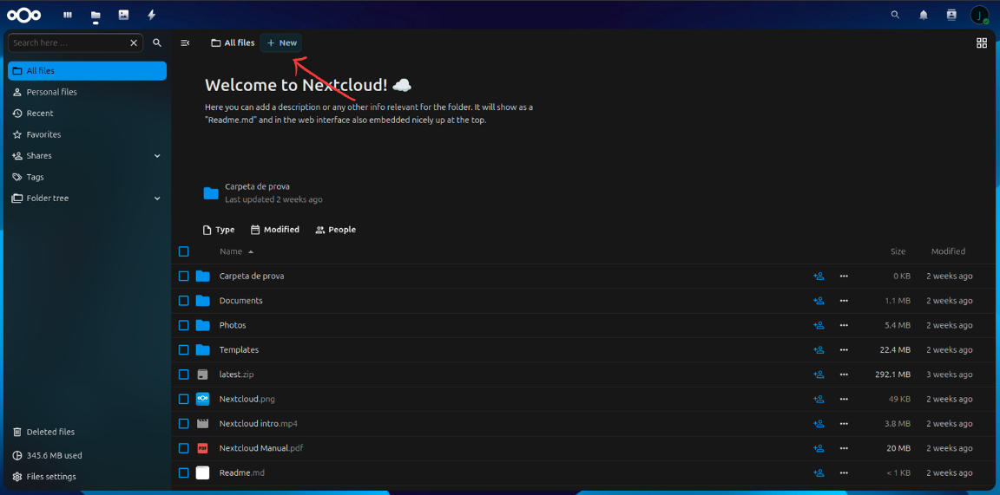
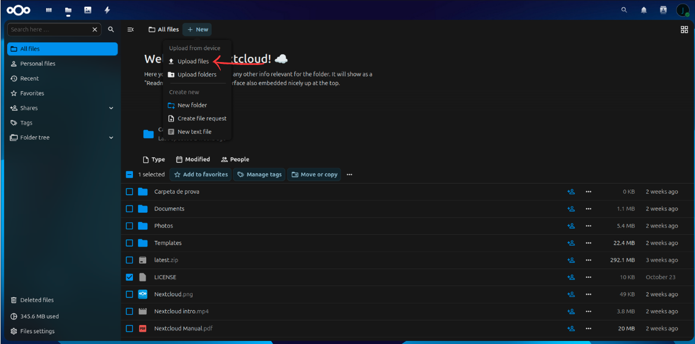
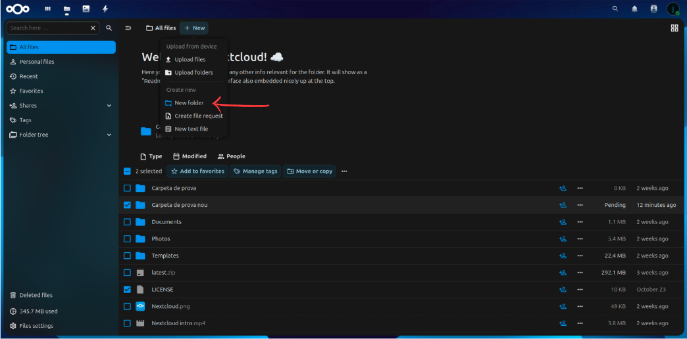
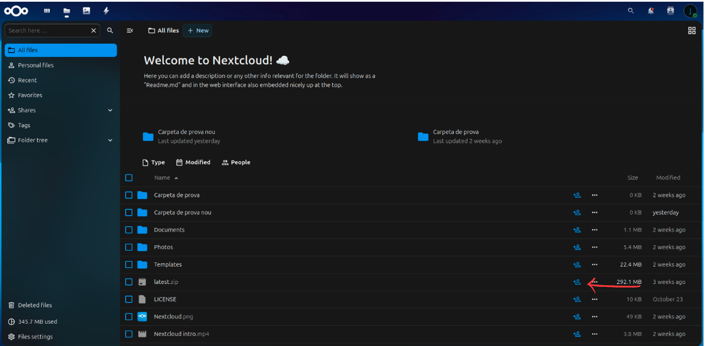
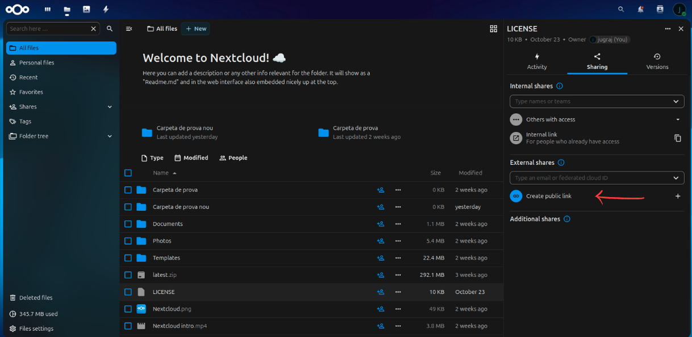
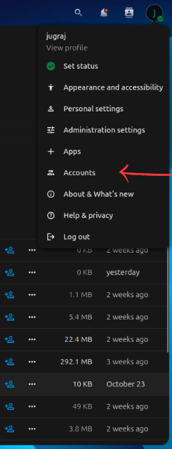
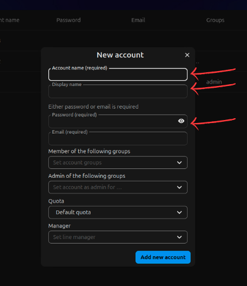
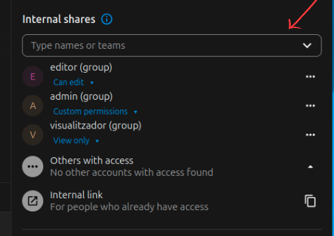
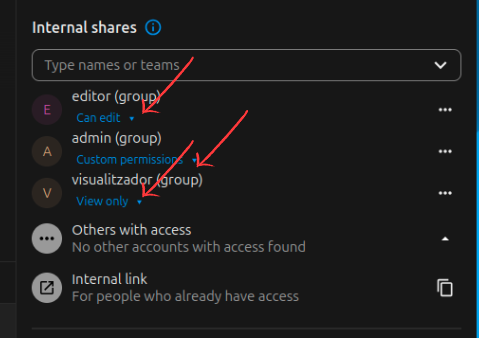

### Para subir un archivo en NextCloud primero de todo tienes que hacer es darle a "new" luego de eso selecciona "Upload Files" se te abrira la carpeta, luego de ahi seleccionas el archivo que quieres subir, siguiendo estos pasos tendras tu archivo en NextCloud.

# Creación de carpeta en NextCloud

### Para crear una carpeta en NetCloud tienes que hacer click al "new" otra vez, luego de eso tienes que hacer click en "New folder" luego de eso pones un nombre cualquiera a tu carpeta y ya tendras tu carpeta hecha en NextCloud

# Creación de Link para compartir
### Para hacer un Link en NextCloud tenemos que hacer un click al logo de una persona con un plus alado del archivo (como mostrado en la imagen)

### Luego de eso te saldran opciones de compartir, selecionamos "Create public Link" eso creara un link al archivo, y cualquier persona con el link podra acceder lo.

# Creación de usuarios

### Para crear nuevos usuarios en NextCloud tenemos que hacer un Click a nuestro perfil, y luego de eso ir a "accounts"

### Aqui tenemos que hacer click a "New account"

### Ahora rellenamos esto y ya tendremos nuestro primer usuario hecho. Tenemos que hacer lo mismo para hacer otros usuarios.

# Permiso de usuario

### Para poner permiso a un archivo tenemos que dar al boton de compartir y luego buscar aqui visualitzador, editor y admin. y ponemos permiso que pertenece a cada usuario.

### Le damos a esta flechita y seleccionamos los permisos que queremos poner, haciendo esto tendremos los permisos puestos.
