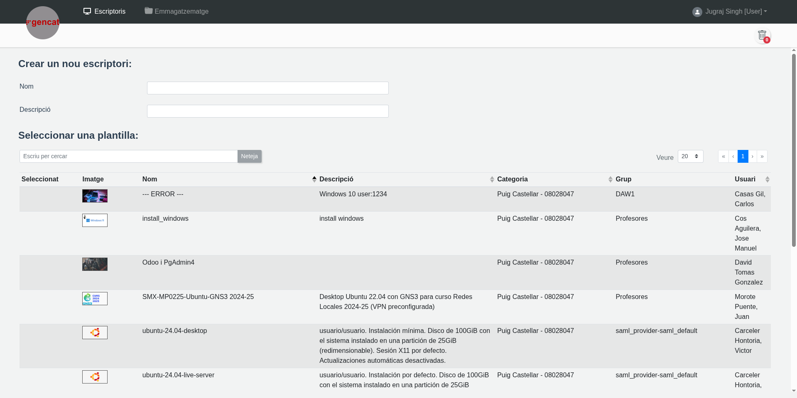
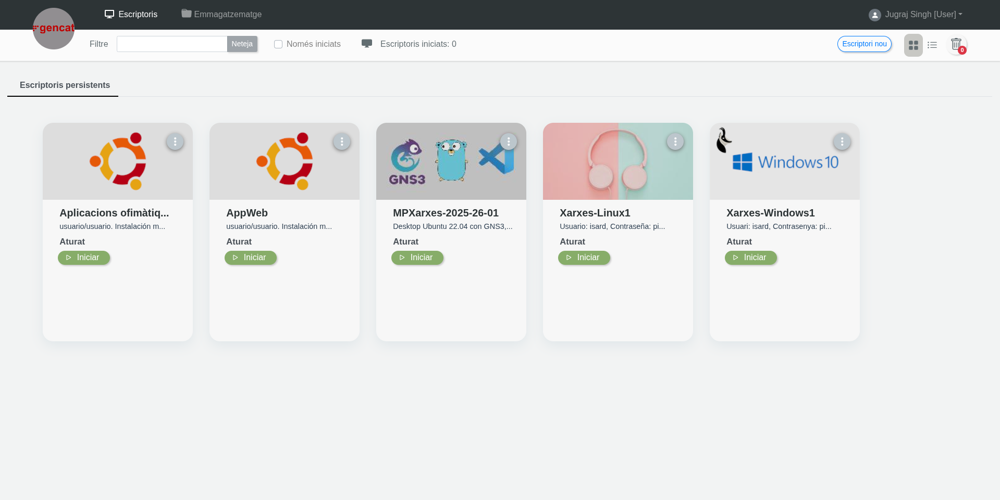

# Manual de como instalar una maquina en IsardVDI

### **Primero de todo tienes que ir a la pagina web official de isardVDI**

- Luego inicias session con tus credenciales
  

- Despues de inciar session, haz un click al boton que se llama "Escriptori nou"

 
 - Ahora pon un nombre de tu gusto a tu maquina y tambien una descripcion si quieres

-  Luego eliges la maquina que quieres instalar

  ej: Ubuntu, Windows etc...

- Luego de hacer eso bajas al final de la pagina i haces un click al "Crea"

- Despues de esto tendras tu maquina de IsardVDI preparada para utilizar solo tienes que dar un click al iniciar y selecionar SPICE como Visor

